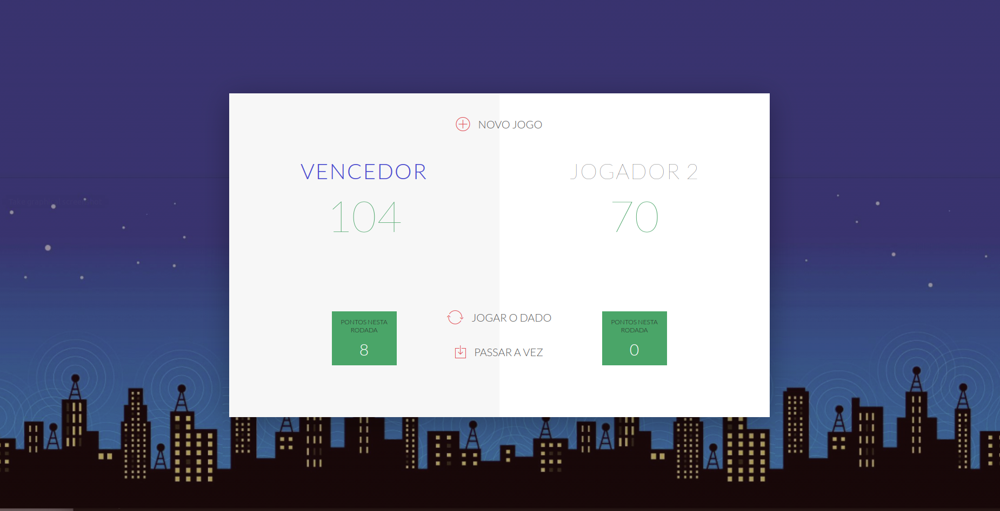

### Roll Dicer Game

Jogo de dados onde dois players ficam rodando seu dado até o primeiro chegar em um número máximo de pontos definido. O player que tirar 0 no dado passa a vez.

### Desenvolvido em:

* JavaScript
* HTML
* CSS
* NodeJS

## Autor

Rafael Rodrigues
